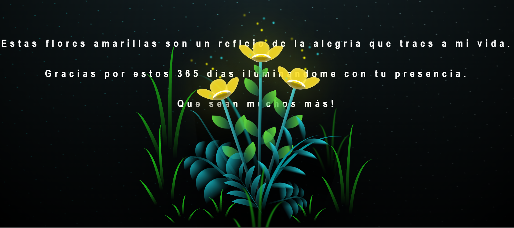

# Proyecto-Flores-Amarillas

Este proyecto, basado en una idea de [DaniCodex](https://github.com/DaniCodex), ha sido adaptado y personalizado por mí para crear un detalle único y especial, perfecto para expresar aprecio de una manera auténtica y geek. 

## Celebración de Nuestro Primer Aniversario
Este proyecto es un tributo creativo y tecnológico que combina programación y emociones, expresando el cariño de una forma especial. 

### Imagen Especial
   - 

## Vista Previa del Proyecto

Aquí tienes una vista previa de la interfaz principal del proyecto:

 - 

